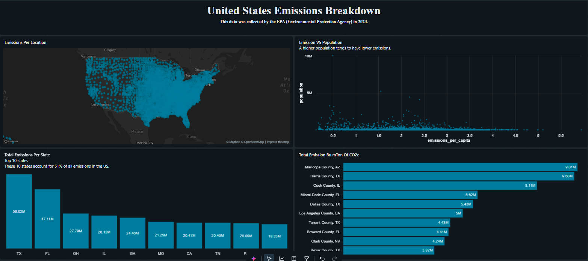

# US Emissions Analysis

## Project Overview
Developed an end-to-end emissions analytics project using SQL on Databricks to analyze greenhouse gas emissions across different U.S. states and counties. The project focused on identifying high-emission regions, calculating emissions per capita, and uncovering environmental trends through interactive dashboards and data-driven insights.

## Tools & Technologies
- Databricks
- SQL
- Data Visualization
- Dashboard Design

## Key Features
- Cleaned and transformed raw emissions data using SQL queries.
- Calculated emissions per capita using population-adjusted metrics.
- Identified top contributing regions and emission patterns.
- Built an interactive dashboard for KPI monitoring and environmental analysis.
- Structured queries for scalable and organized analytics workflows.

## Dashboard Insights
- Top regions by emissions per capita
- Population vs emissions comparison
- State-level environmental trends
- KPI summaries for emissions monitoring

## 📊 Project Dashboard

## Project Outcome
This project demonstrates practical experience in SQL analytics, data transformation, dashboard development, and cloud-based data analysis workflows using Databricks.
