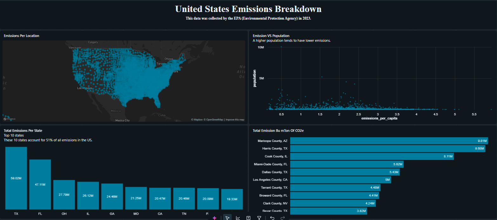

# U.S. Greenhouse Gas Emissions Analysis

## 📝 Project Overview
This project delivers a comprehensive data analysis of U.S. greenhouse gas (GHG) emissions using the EPA dataset collected in 2023. By leveraging **Databricks SQL** for advanced data querying and **Power BI** for visual storytelling, the project monitors per-capita emission trends, county-level breakdowns, and resource consumption metrics across states[cite: 4].

## 🎯 Key Business & Environmental Questions Answered
* Which U.S. states and counties generate the highest greenhouse gas (GHG) emissions[cite: 4]?
* How does population size impact per-capita emissions[cite: 4]?
* What is the relationship between energy consumption (electricity, gas, fuel) and emission levels[cite: 4]?
* Which states account for the majority of total national emissions[cite: 4]?

## 🛠️ Tech Stack & Tools
* **Data Processing & Analytics:** Databricks SQL (Window Functions, CTEs, Aggregations, String Cleaning)[cite: 4]
* **Data Visualization:** Power BI[cite: 4]
* **Dataset Source:** EPA (Environmental Protection Agency, 2023)[cite: 4]

## ⚙️ SQL Analysis & Queries (`emissions_analysis.sql`)
The analysis scripts utilize advanced SQL operations on Databricks to clean and extract insights, including:
* **String Cleaning & Casting:** Sanitizing numeric fields containing commas and casting them to `DOUBLE` for mathematical operations[cite: 4].
* **Per-Capita Metrics:** Computing emissions per capita and emissions per job/housing unit[cite: 4].
* **Conditional Segmentation:** Categorizing counties into 'High', 'Medium', and 'Low' emission tiers using `CASE` statements[cite: 4].
* **Advanced Ranking:** Using Window Functions (`RANK() OVER(PARTITION BY...)`) to find the top emitting counties within each state[cite: 4].
* **Percentage Contributions:** Calculating state-level emission percentages against the national total using windowed sums[cite: 4].

## 📊 Dashboard Insights

* **Top Emitting States:** Texas (TX) and Florida (FL) lead the nation in total emissions, with the top 10 states accounting for **51% of all emissions in the U.S.**
* **County Breakdown:** Maricopa County, AZ, and Harris County, TX, top the county-level metrics with over 9.8M and 9.68M metric tons of CO2e respectively.
* **Population vs. Emissions:** The scatter analysis highlights inverse trends where certain high-population areas maintain lower per-capita footprints.
